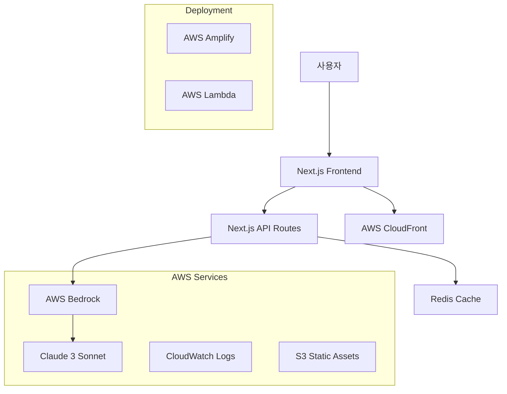
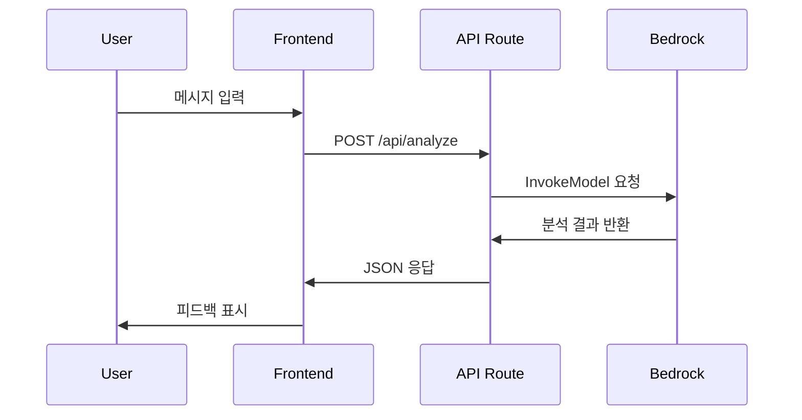

# CultureChat 아키텍처 문서

## 🏗️ 시스템 개요

CultureChat은 AWS Bedrock을 활용한 실시간 문화적 매너 분석 서비스로, Next.js 기반의 풀스택 웹 애플리케이션입니다.

## 📐 전체 아키텍처



## 🔧 기술 스택

### Frontend
- **Next.js 14**: React 기반 풀스택 프레임워크
- **TypeScript**: 타입 안전성
- **Tailwind CSS**: 유틸리티 기반 스타일링
- **React Hooks**: 상태 관리

### Backend
- **Next.js API Routes**: 서버리스 API
- **AWS Bedrock**: AI/ML 서비스
- **Claude 3 Sonnet**: 대화형 AI 모델

### Infrastructure
- **AWS Amplify**: 호스팅 및 배포
- **AWS CloudFront**: CDN
- **AWS CloudWatch**: 모니터링 및 로깅

## 🏛️ 컴포넌트 아키텍처

### Frontend 컴포넌트 구조
```
app/
├── page.tsx                 # 메인 페이지 (라우트)
├── layout.tsx              # 루트 레이아웃
├── globals.css             # 글로벌 스타일
└── components/
    ├── ChatInterface.tsx    # 채팅 메인 컨테이너
    ├── CountrySelector.tsx  # 국가 선택 UI
    ├── MessageInput.tsx     # 메시지 입력 폼
    └── MannerFeedback.tsx   # 피드백 표시 컴포넌트
```

### API 구조
```
app/api/
└── analyze/
    └── route.ts            # 문화적 매너 분석 엔드포인트
```

## 🔄 데이터 플로우

### 1. 사용자 메시지 입력 플로우


### 2. 국가별 문화 분석 로직
```typescript
interface AnalysisRequest {
  message: string
  targetCountry: string
}

interface AnalysisResponse {
  type: 'warning' | 'good'
  message: string
  suggestion?: string
}
```

## 🧩 핵심 모듈

### 1. 문화적 매너 분석 엔진
**위치**: `app/api/analyze/route.ts`

**기능**:
- Bedrock Claude 3 모델 호출
- 국가별 문화적 컨텍스트 적용
- 위험도 분석 및 대안 제안

**프롬프트 구조**:
```typescript
const prompt = `
당신은 문화적 매너 전문가입니다.
메시지: "${message}"
대상 국가: ${targetCountry}

JSON 형식으로 분석 결과를 반환하세요.
`
```

### 2. 실시간 채팅 인터페이스
**위치**: `app/components/ChatInterface.tsx`

**상태 관리**:
```typescript
interface Message {
  id: string
  text: string
  timestamp: Date
  feedback?: AnalysisResponse
}

const [messages, setMessages] = useState<Message[]>([])
```

### 3. 국가별 설정 관리
**위치**: `app/components/CountrySelector.tsx`

**지원 국가**:
- 미국 (US) - 개인정보, 종교, 정치 민감
- 일본 (JP) - 직접적 표현, 거절 방식 주의
- 중국 (CN) - 정치적 주제 민감
- 영국 (GB) - 계급, 지역 차별 주의
- 독일 (DE) - 역사적 주제 민감
- 프랑스 (FR) - 언어, 문화 자부심 고려

## 🔐 보안 아키텍처

### 1. API 보안
- AWS IAM 역할 기반 접근 제어
- 환경변수를 통한 자격증명 관리
- HTTPS 강제 적용

### 2. 데이터 보안
- 사용자 메시지 로깅 최소화
- 개인정보 익명화 처리
- AWS 보안 모범 사례 적용

## 📊 성능 최적화

### 1. Frontend 최적화
- Next.js App Router 활용
- 컴포넌트 레벨 코드 분할
- Tailwind CSS 최적화

### 2. API 최적화
- Bedrock 응답 캐싱 (향후 구현)
- 요청 디바운싱
- 에러 핸들링 및 재시도 로직

### 3. 인프라 최적화
- CloudFront CDN 활용
- 정적 자산 최적화
- 서버리스 아키텍처로 자동 스케일링

## 🔮 확장 계획

### Phase 1: 기본 기능 (현재)
- [x] 기본 채팅 인터페이스
- [x] Bedrock 연동
- [x] 6개국 지원

### Phase 2: 고도화
- [ ] WebSocket 실시간 통신
- [ ] 사용자 학습 기록
- [ ] 더 많은 국가 지원
- [ ] 모바일 앱 개발

### Phase 3: 엔터프라이즈
- [ ] 다중 언어 지원
- [ ] 팀/조직 관리
- [ ] 분석 대시보드
- [ ] API 서비스 제공

## 🚀 배포 아키텍처

### 개발 환경
```
Developer → GitHub → Local Development
```

### 스테이징 환경
```
GitHub → GitHub Actions → AWS Amplify (Staging)
```

### 프로덕션 환경
```
GitHub (main) → GitHub Actions → AWS Amplify (Production)
                                ↓
                            CloudFront CDN
                                ↓
                            Global Users
```

## 📈 모니터링 및 로깅

### 1. 애플리케이션 모니터링
- AWS CloudWatch 메트릭
- Next.js 빌트인 분석
- 사용자 행동 추적

### 2. 인프라 모니터링
- AWS CloudWatch 대시보드
- 알람 및 알림 설정
- 성능 메트릭 추적

### 3. 로그 관리
```typescript
// 구조화된 로깅
console.log({
  timestamp: new Date().toISOString(),
  level: 'INFO',
  service: 'culture-chat',
  action: 'analyze_message',
  country: targetCountry,
  success: true
})
```

## 🔧 개발 도구 및 워크플로우

### 1. 개발 도구
- **TypeScript**: 타입 안전성
- **ESLint**: 코드 품질
- **Prettier**: 코드 포맷팅
- **Husky**: Git 훅 관리

### 2. 테스트 전략
- **Unit Tests**: Jest + React Testing Library
- **Integration Tests**: API 엔드포인트 테스트
- **E2E Tests**: Playwright (향후 구현)

### 3. CI/CD 파이프라인
```yaml
# GitHub Actions 워크플로우
Build → Test → Security Scan → Deploy → Monitor
```

이 아키텍처는 확장 가능하고 유지보수가 용이하도록 설계되었으며, AWS 서비스를 최대한 활용하여 안정적이고 성능이 우수한 서비스를 제공합니다.